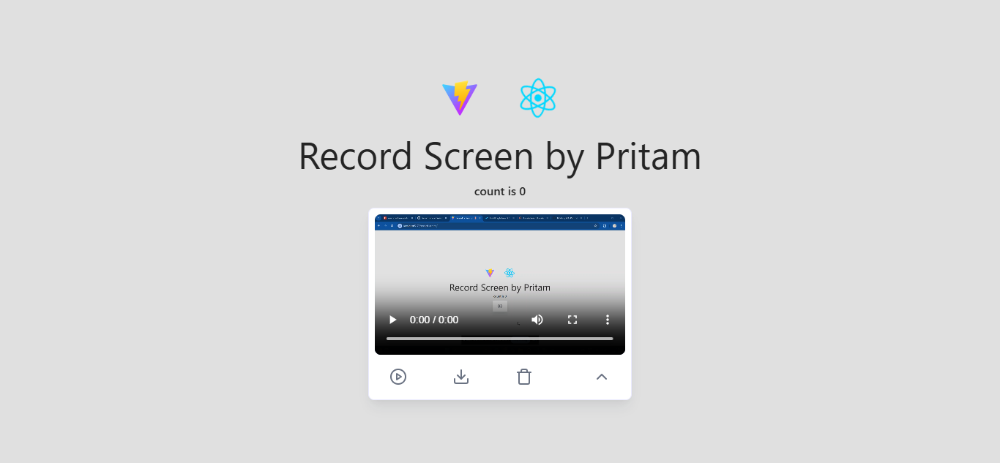

# Record Screen by Pritam

## Demo Image
<div style="width:100%;">
<a href="https://pridebnath.github.io/record-screen/">

</a>
</div>

## Demo Video
https://github.com/PriDebnath/record-screen/blob/main/src/assets/final-demo.mp4

https://github.com/PriDebnath/record-screen/blob/main/src/assets/final-demo.mkv

## Set up

#### Install all packages required for the application

```
  npm install --legacy-peer-deps
```

#### Start development server

```
  npm run dev
```

Navigate to `hhttp://localhost:5173/record-screen/`.
